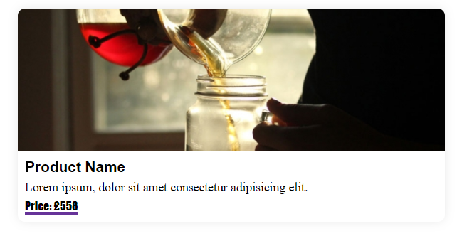
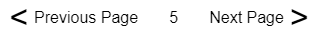
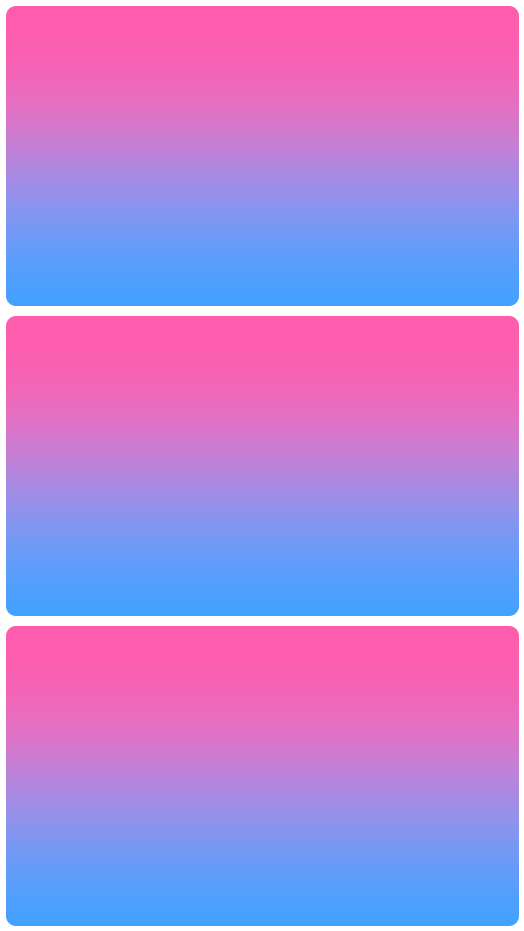
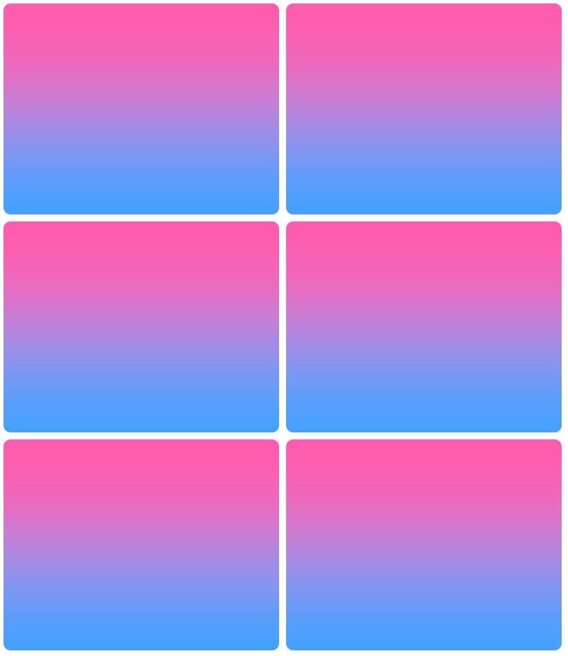
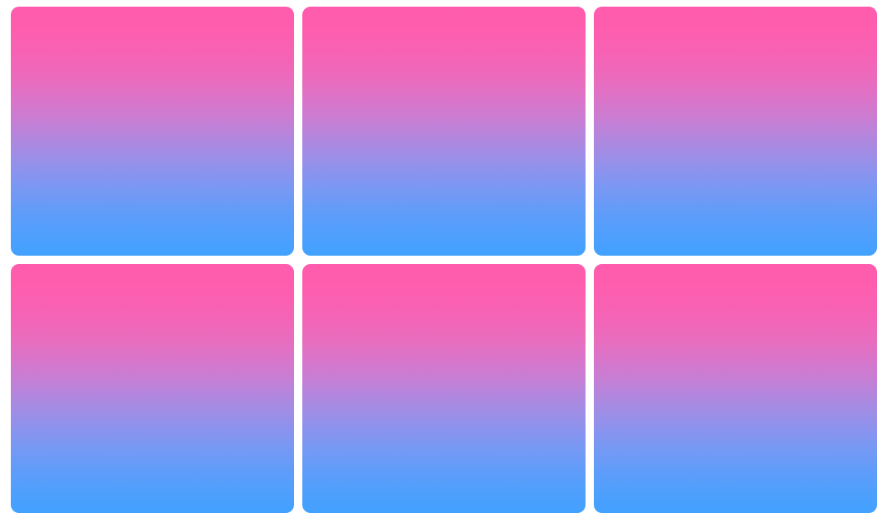
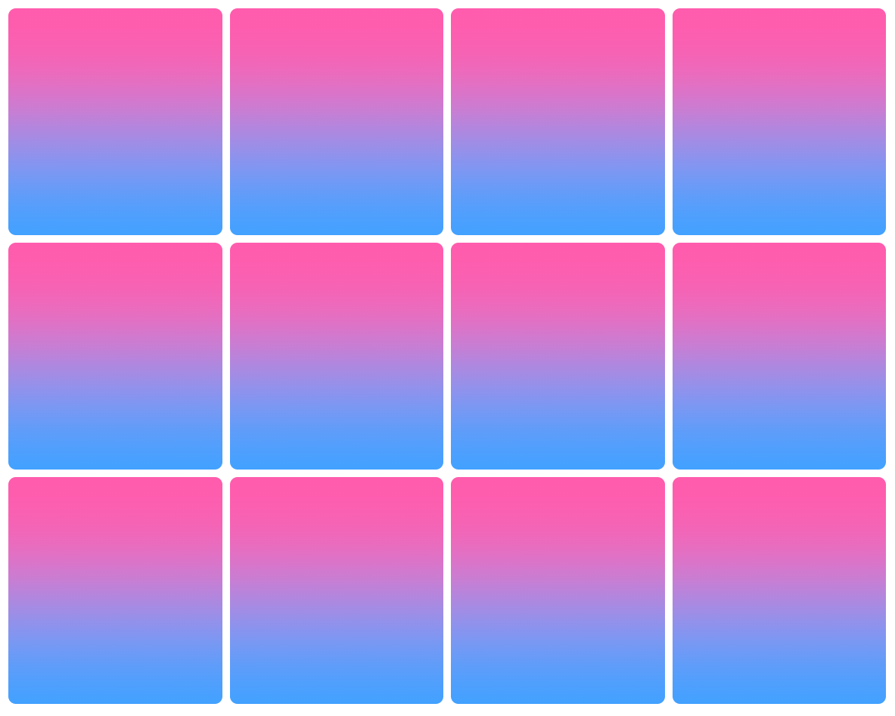

# ✨ Live Pairing Tech Test ✨

## Intro 📣

- Test is 45 Min's Long
- You don't need to finish everything
- Work how you normally would
  - Use google/documentation
  - Ask questions
  - Have fun 🎉

## Goal 🏁

We would like you to build a list of cards, including pagination based off the results from an API.

We will be looking out for:

- Clean CSS styles
- An understanding of state and data fetching
- Use of Test Driven Development

## Where to Start 🌠

Get the dev environment up and running!

```bash
yarn dev
```

Might also be a good idea to start watching the tests!

```bash
yarn test
```

## Guidelines 🕵️‍♀️

### Functionality 🤖

- Fetch from the API using getServerSideProps
- Render results with 12 per page
- Pagination should update displayed results

### Design 🎨

#### Card



- Image Height is `200px`, full width.
- All padding/margin seen is `10px`
- Border Radius is `10px`
- Box shadow `0px 0px 15px -2px #e0e0e0`
- Price underline is `rebeccapurple`
- Title
  - font-family `sans-serif`
  - font-size `1.3rem`
  - font-weight `bold`
- Description
  - font-family `serif`
  - font-size `1.1rem`
- Price
  - font-family `fantasy`
  - font-size `1rem`

#### Pagination

Pagination with `<` & `>` added and styled to buttons.



#### Responsive Layout

- Achieve a responsive layout with up to 4 cards showing at 1200px width.
- Each card should get no smaller than 260px and no bigger than 600px.
- Spacing is 10px





